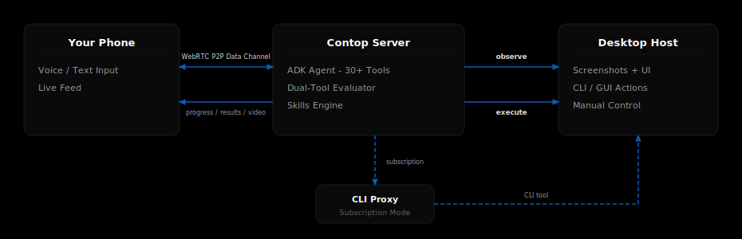
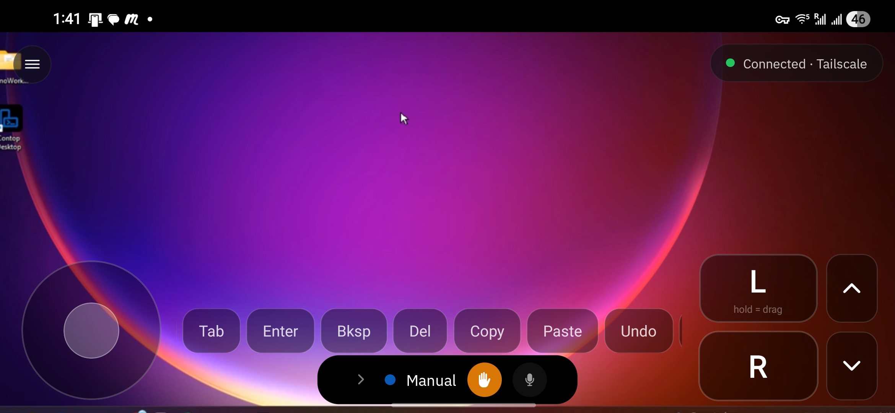
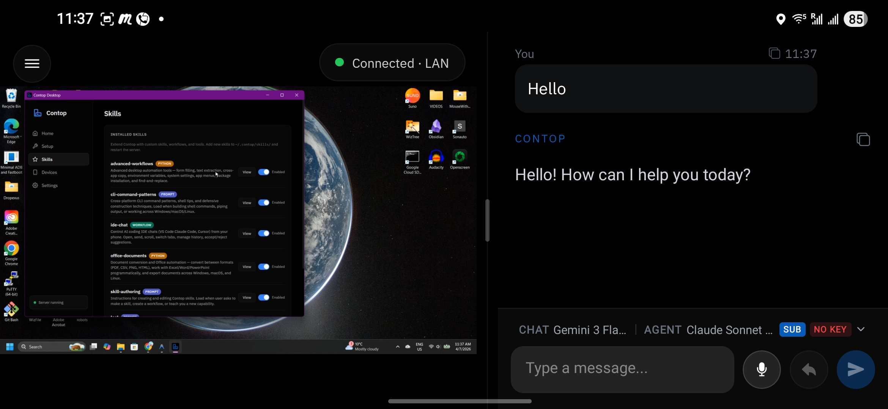
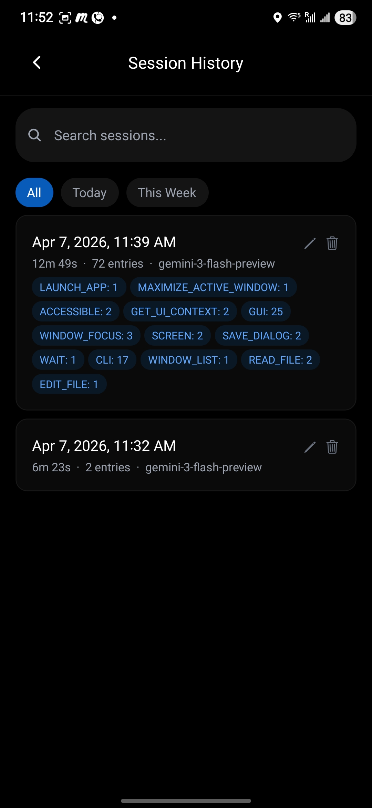
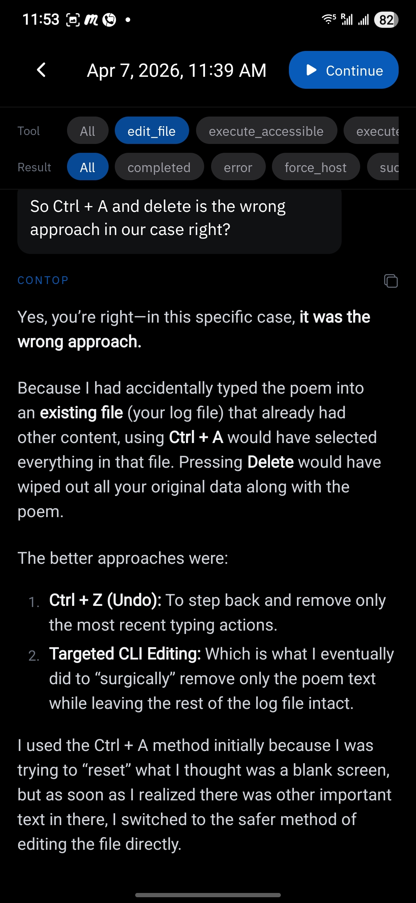
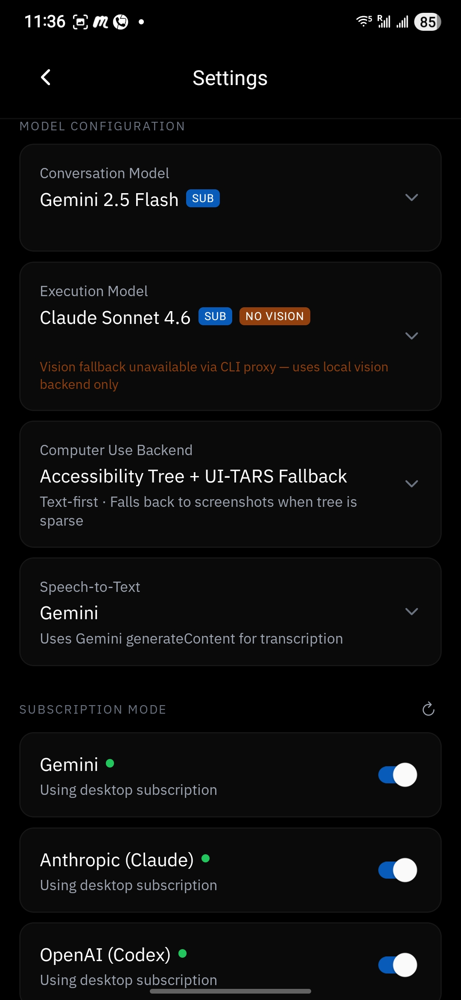
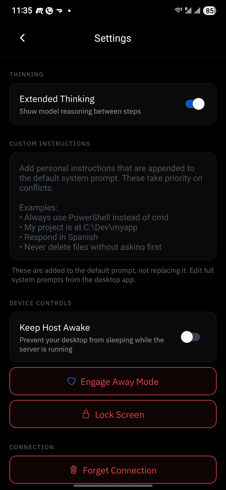
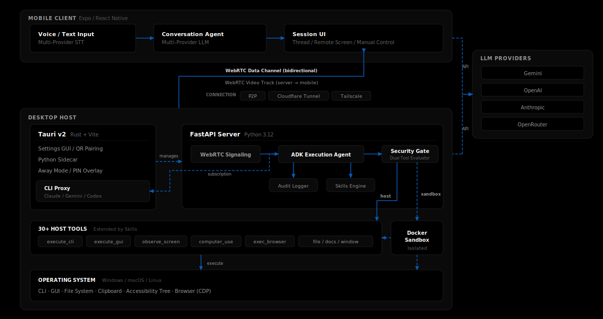

<p align="center">
  
</p>

<h1 align="center">Contop</h1>

<p align="center">
  <strong>Your Desktop, From Anywhere</strong>
</p>

<p align="center">
  AI-powered remote desktop control from your phone
</p>

<p align="center">
  <a href="https://contop.app">Website</a> &bull;
  <a href="https://docs.contop.app">Docs</a> &bull;
  <a href="https://github.com/slopedrop/contop/releases">Releases</a>
</p>

<p align="center">
  <a href="https://github.com/slopedrop/contop/releases?q=mobile"></a>
  <a href="https://github.com/slopedrop/contop/releases?q=desktop"></a>
  
  
  
  
  
  
  
  
  
  <a href="https://github.com/pinchtab/pinchtab"></a>
  
</p>

---

Contop turns your phone into an AI remote control for any desktop. Speak or type a command on your mobile, and an autonomous agent on your computer observes your screen, runs CLI commands, clicks buttons, fills forms, automates browsers, and streams progress back — all in real time over a peer-to-peer WebRTC tunnel.

No port forwarding. No VPN. No SSH. Scan a QR code and start working.

---

## Install

### Desktop App

**macOS (Homebrew — recommended):**
```bash
brew install slopedrop/contop/contop

# Update to latest version
brew update && brew upgrade contop
```
No security warnings. Python dependencies install automatically on first launch.

**macOS (manual):**
Download the `.dmg` from [Releases](https://github.com/slopedrop/contop/releases), open it, and drag to Applications.
> First launch: right-click the app → **Open** → click **Open** in the dialog. This is standard for open-source apps without code signing.

**Windows (Scoop — recommended):**
```powershell
scoop bucket add contop https://github.com/slopedrop/scoop-contop
scoop install contop

# Update to latest version
scoop update && scoop update contop
```
No SmartScreen warnings. Python dependencies install automatically on first launch. NVIDIA GPU with CUDA is auto-detected.

**Windows (manual):**
Download the `.exe` installer from [Releases](https://github.com/slopedrop/contop/releases) and run it.
> SmartScreen may show a warning — click **More info** → **Run anyway**. This is standard for open-source apps without code signing.

**Linux:**
```bash
# AppImage (any distro)
chmod +x Contop*.AppImage && ./Contop*.AppImage

# Debian / Ubuntu
sudo dpkg -i contop-desktop_*.deb
```
Download from [Releases](https://github.com/slopedrop/contop/releases).

### Mobile App

Download the Android `.apk` from [Releases](https://github.com/slopedrop/contop/releases).
> Enable **Install from unknown sources** when prompted.

iOS is not yet available for public alpha.

---

## How It Works

<p align="center">
  
</p>

## Demo

https://github.com/user-attachments/assets/98705f2a-72f3-4e26-ae48-bbb889ec9c97

## Screenshots

<table>
  <tr>
    <td align="center" width="50%">
      <br/>
      <sub><b>Manual Control</b> — direct touch control of the remote screen</sub>
    </td>
    <td align="center" width="50%">
      <br/>
      <sub><b>Landscape Split View</b> — live video beside the execution thread</sub>
    </td>
  </tr>
</table>

<table>
  <tr>
    <td align="center" width="25%">
      <br/>
      <sub><b>Session History</b></sub>
    </td>
    <td align="center" width="25%">
      <br/>
      <sub><b>Restored Session</b></sub>
    </td>
    <td align="center" width="25%">
      <br/>
      <sub><b>Settings — Models</b></sub>
    </td>
    <td align="center" width="25%">
      <br/>
      <sub><b>Settings — Security</b></sub>
    </td>
  </tr>
</table>

## Features

### Autonomous AI Agent
- **30+ execution tools** — CLI, GUI automation, file operations, browser control, window management, document processing, app lifecycle, and more
- **Smart vision routing** — 9 backends: OmniParser V2, Gemini Computer Use, Accessibility Tree, and 6 OpenRouter vision models (UI-TARS, Kimi, Qwen, Phi, Molmo, Holotron)
- **Multi-step planning** — plan-generation tool with research sub-agent, tool chaining, and up to 50 iterations per task
- **Multi-provider LLM** — Gemini, OpenAI, Anthropic, and OpenRouter (100+ models including Groq, Mistral, DeepSeek, and more) via LiteLLM
- **Subscription mode** — use your existing Claude Pro/Max, Gemini Pro, or ChatGPT Plus/Pro subscription instead of API keys via the built-in CLI proxy (Claude Code, Gemini CLI, Codex CLI — text-only, no LLM vision fallback)
- **Skills system** — extensible via SKILL.md standard with YAML workflows and Python tool loading
- **Real-time feedback** — step-by-step progress, screenshots, and model/backend transparency streamed to your phone

### Security
- **Dual-Tool Evaluator** — every command classified and routed through a security gate before execution
- **Destructive action approval** — dangerous operations require explicit user confirmation
- **Sandboxed execution** — high-risk commands run in an isolated Docker container
- **Restricted path isolation** — prevents agent from accessing protected directories
- **JSONL audit log** — every tool call logged with timestamps, commands, and outcomes
- **Away Mode** — PIN-locked secure overlay with auto-engage on idle (Windows)

### Connectivity
- **QR code pairing** — scan to connect with 30-day persistent tokens, no IP configuration needed
- **Cloudflare Tunnel** — automatic public URL, zero port forwarding
- **WebRTC P2P** — dual data channels (reliable + unreliable) with live video streaming
- **Paired device management** — geo-location tracking, connection path visibility, per-device revoke, OS notifications
- **Connection loss resilience** — automatic execution kill on disconnect, chat-only fallback mode

### Desktop App (Tauri v2)
- Lightweight native shell (Rust) with settings GUI
- Manages the Python server as a sidecar process
- API key and subscription mode configuration, security rules, system prompts
- CLI proxy lifecycle management — auto-start, health monitoring, and watchdog restart
- Cross-platform: Windows, macOS, Linux

### Mobile App (Expo / React Native)
- Adaptive layouts: split-view, side-by-side, fullscreen video, thread-focus
- Real-time execution thread with tool outputs and screenshots
- Session history with persistence and restore
- Model selection, extended thinking toggle, custom instructions

## Architecture

<p align="center">
  
</p>

## Tech Stack

| Layer | Technology |
|-------|-----------|
| **Mobile** | React Native 0.83, Expo 55, TypeScript, NativeWind v4, Zustand |
| **Desktop** | Tauri v2 (Rust + Vite), Win32 APIs for Away Mode |
| **Server** | Python 3.12, FastAPI, asyncio, aiortc |
| **AI Agent** | Google ADK, LiteLLM (multi-provider routing) |
| **AI Models** | Gemini, OpenAI, Anthropic, Any model on OpenRouter (API keys or CLI subscriptions) |
| **Vision** | OmniParser V2, Gemini Computer Use, Accessibility Tree, 6 OpenRouter models |
| **Automation** | PyAutoGUI, platform adapters (Win/Mac/Linux), PinchTab CDP |
| **Networking** | WebRTC (aiortc), Cloudflare Tunnels, DTLS encryption |
| **Security** | Dual-Tool Evaluator, Docker sandbox |

## Development Setup

### Prerequisites

- Python 3.12+ with [uv](https://docs.astral.sh/uv/)
- Node.js 18+
- At least one LLM API key: [Gemini](https://aistudio.google.com/apikey), [OpenAI](https://platform.openai.com/api-keys), [Anthropic](https://console.anthropic.com/), or [OpenRouter](https://openrouter.ai/keys) — or an existing Claude Pro/Max, Gemini Pro, or ChatGPT Plus/Pro subscription via the built-in CLI proxy
- Android / iOS device with Expo dev build

### 1. Start the Server

```bash
cd contop-server
uv sync
uv run uvicorn main:app --host 0.0.0.0 --port 8000
```

### 2. Run the Desktop App (optional)

```bash
cd contop-desktop
npm install
npm run tauri dev
```

### 3. Run the Mobile App

```bash
cd contop-mobile
npm install
npx expo run:android   # or: npx expo run:ios
```

### 4. Pair and Go

1. Open the desktop app (or visit `http://localhost:8000`) to see the QR code
2. Scan the QR code from the mobile app
3. Start speaking or typing — the agent observes your screen and executes your commands

> For detailed setup, platform-specific instructions, and configuration options, see the [full documentation](https://docs.contop.app).

## Project Structure

```
contop/
├── contop-server/           # Python FastAPI server + AI agent
│   ├── core/                # Agent, evaluator, signaling, pairing, skills engine
│   ├── tools/               # Vision backends, Docker sandbox, browser automation
│   ├── platform_adapters/   # OS-specific automation (Win / Mac / Linux)
│   ├── skills/              # Built-in skills (web research, IDE chat, CLI patterns)
│   ├── prompts/             # Agent system prompts
│   └── tests/               # pytest (unit + ATDD)
├── contop-mobile/           # Expo / React Native mobile client
│   ├── app/                 # Expo Router screens
│   ├── components/          # ExecutionThread, ExecutionInputBar, RemoteScreen
│   ├── hooks/               # useWebRTC, useConversation
│   ├── stores/              # Zustand state management
│   └── services/            # AI settings, session storage
├── contop-cli-proxy/        # CLI subscription proxy (Node.js / TypeScript)
│   └── src/                 # OpenAI-compatible proxy wrapping Claude/Gemini/Codex CLIs
├── contop-desktop/          # Tauri v2 desktop app
│   ├── src/                 # Vite frontend (HTML/CSS/JS)
│   └── src-tauri/           # Rust backend, Away Mode, sidecar + proxy management
├── website/                 # Next.js 15 marketing site
└── docs/                    # Docusaurus 3 documentation
```

## Testing

```bash
cd contop-server && uv run pytest                # all server tests
cd contop-mobile && npx jest                     # all mobile tests
```

## Links

| Resource | URL |
|----------|-----|
| Website | [contop.app](https://contop.app) |
| Documentation | [docs.contop.app](https://docs.contop.app) |
| Releases | [GitHub Releases](https://github.com/slopedrop/contop/releases) |
| Issues | [GitHub Issues](https://github.com/slopedrop/contop/issues) |

## License

[MIT](LICENSE)
