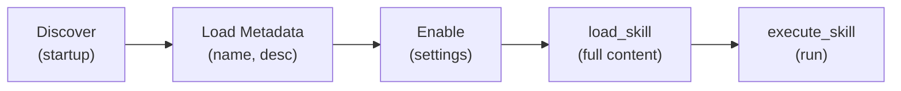

# Skill Tools

Tools for managing and executing skills — modular capability extensions for the agent.

## `execute_skill`

Execute a skill by name.

| Parameter | Type | Description |
|-----------|------|-------------|
| `skill_name` | `string` | Name of the skill to execute |
| `params` | `object` | Skill-specific parameters (optional) |

**Classification:** Depends on skill type

**Return shape:**
```json
{
  "status": "success",
  "stdout": "skill execution output",
  "exit_code": 0,
  "duration_ms": 5000
}
```

**Notes:**
- Only enabled skills can be executed (controlled via `enabled_skills` in settings)
- Progressive disclosure: Full skill instructions are injected only when the agent activates the skill

## `load_skill`

Load a skill's full instructions into the agent's context.

| Parameter | Type | Description |
|-----------|------|-------------|
| `skill_name` | `string` | Name of the skill to load |

**Classification:** Host

**Notes:**
- At startup, only skill metadata (name, description) is loaded
- `load_skill` retrieves the full SKILL.md content and any associated scripts
- This two-phase approach keeps the agent's initial context lean

## `create_skill`

Create a new skill with a SKILL.md template.

| Parameter | Type | Description |
|-----------|------|-------------|
| `name` | `string` | Skill name (lowercase, alphanumeric, hyphens) |
| `description` | `string` | What the skill does |

**Classification:** Host

**Notes:**
- Creates `~/.contop/skills/{name}/SKILL.md` with YAML frontmatter template
- Name validation: `^[a-z0-9][a-z0-9\-]{0,63}$`

## `edit_skill`

Edit an existing skill's SKILL.md content.

| Parameter | Type | Description |
|-----------|------|-------------|
| `skill_name` | `string` | Name of the skill to edit |
| `content` | `string` | New SKILL.md content |

**Classification:** Host

**Notes:**
- Validates YAML frontmatter before saving
- Frontmatter must include `name` and `description` fields

## Skill Lifecycle



1. **Discovery** — Skills are discovered in `~/.contop/skills/` at startup
2. **Metadata loading** — Only name, description, version, type loaded initially
3. **Enable** — User enables via settings or API
4. **Full load** — Agent calls `load_skill` to get complete instructions
5. **Execute** — Agent calls `execute_skill` to run the skill

---

**Related:** [Skills Engine](/api-reference/skills) · [Tool Layers](/architecture/tool-layers)
