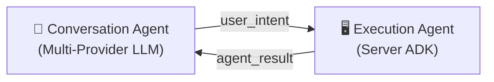

# ADK Agent

Contop's execution agent is built on [Google ADK (Agent Development Kit)](https://google.github.io/adk-docs/) — a Python framework for building autonomous AI agents with tool-calling capabilities.

## Two-Tier Agent Architecture



1. **Conversation Agent** (mobile) — Multi-provider LLM (Gemini, OpenAI, Anthropic, OpenRouter) classifies user intent. Text responses handled locally; tool-requiring commands routed to server.
2. **Execution Agent** (server) — ADK `LlmAgent` with 30+ tools for autonomous multi-step execution (40+ with optional skills).

## ADK Configuration

The execution agent is configured in `core/execution_agent.py` and `core/agent_config.py`:

```python
agent = LlmAgent(
    model=execution_model,        # Default: "gemini-2.5-flash"
    name="contop_executor",
    instruction=system_prompt,     # From prompts/execution-agent.md
    tools=[...],                   # 30+ tool functions (plain callables)
)
```

### Key Parameters

| Parameter | Default | Purpose |
|-----------|---------|---------|
| `model` | `gemini-2.5-flash` | LLM for reasoning and tool selection |
| `max_iterations` | 50 | Maximum tool-calling loops |
| `max_execution_time` | 600s (10 min) | Wall-clock safety cap |

## Callback System

Three callbacks enforce security, observability, and image management:

### `before_tool_callback`

**Mandatory security gate.** Every tool call passes through `DualToolEvaluator.classify()` before execution. This callback:

- Classifies the command as host, sandbox, or confirmation-required
- Routes to the appropriate execution environment (host or [Docker sandbox](/security/docker-sandbox))
- Blocks forbidden commands from reaching host execution

:::danger
Registering tools on the agent without the `before_tool_callback` is forbidden. This callback IS the structural enforcement of the security gate.
:::

### `after_tool_callback`

Runs after every tool execution to:

- Send `agent_progress` messages to the mobile app via data channel
- Record the action in the ring buffer (50-entry action history)
- Write audit log entries (JSONL)

Silent tool calls (no progress update sent) are forbidden.

### `before_model_callback` (Image + Memory Management)

Runs before every LLM call to manage images and context:

1. **Strip pass** — Remove all previously-injected inline JPEG `Part` objects from `llm_request.contents` (~100–150 KB per screenshot)
2. **Inject pass** — Add only the latest screenshot as an inline `Part` (decoded from base64)
3. **Memory processors** — For non-Gemini models, apply `ToolCallFilter` and `TokenLimiter` to fit within the model's context window

This bridges an ADK limitation: Gemini cannot interpret base64 strings in `FunctionResponse` as images — only inline `Part` objects work. See [Vision Routing](/architecture/vision-routing) for details on the 9 vision backends.

## Planning as a Tool

Planning is not a separate pre-execution phase — it's a tool (`generate_plan`) the execution agent can invoke mid-run when it decides a task needs upfront planning.

When the agent calls `generate_plan(task_description)`:

1. An **ephemeral planning sub-agent** is created (its own `LlmAgent` instance with `InMemorySessionService`)
2. The sub-agent receives the same tools as the execution agent (minus `generate_plan` itself to prevent recursion)
3. It runs with a budget of 15 LLM calls to analyze the task and produce a structured plan
4. The plan is sent to the user's phone for **approval** — the user can approve or reject
5. The tool returns the plan and approval status to the execution agent, which proceeds accordingly

The planning sub-agent uses the prompt from `prompts/planning-agent.md` and applies `BuiltInPlanner` with thinking config if thinking mode is enabled.

## Per-Tool OS-Specific Instructions

The `_TOOL_INSTRUCTIONS` registry in `core/agent_config.py` injects platform-aware guidance into the execution agent's system prompt. Each tool can define instructions for `_all` (shared), `Windows`, `Darwin`, and `Linux`:

- **Path-sensitive tools** (`execute_cli`, `save_dialog`, `open_dialog`, `read_file`, `edit_file`, `find_files`) — backslash vs forward-slash path conventions
- **App naming tools** (`launch_app`, `close_app`, `window_focus`) — `.exe` names vs macOS bundle names vs Linux binaries
- **Accessibility tools** (`execute_accessible`) — UIA (Windows), AX (macOS), AT-SPI (Linux) control types
- **System tools** (`install_app`, `set_env_var`, `change_setting`) — OS-specific mechanisms

Dynamic resolution is supported — for example, `execute_cli` on Windows detects whether Git Bash is available and adjusts shell guidance accordingly. Instructions are formatted as a `## Tool-Specific Instructions ({PLATFORM})` section injected via the `{tool_instructions}` placeholder in the execution prompt template.

## Session Persistence

The execution agent uses ADK's `DatabaseSessionService` backed by SQLite at `~/.contop/data/sessions.db`. Every tool call, tool result, and model response is persisted — the full execution history survives server restarts.

- **Session reuse** — The same `session_id` is reused across intents within a conversation, giving the agent multi-turn memory
- **Session restore** — On WebRTC reconnect, mobile sends its stored `adk_session_id`; the server restores the ADK session from SQLite before processing the next intent
- **Session cleanup** — Sessions older than 7 days are automatically deleted on server startup via `cleanup_old_sessions()`
- **Planning sub-agent** — Uses ephemeral `InMemorySessionService` (one-shot, discarded after each planning run)

For the full context flow including offset tracking and tool summary persistence, see [Context Flow](/architecture/context-flow).

## Session Lifecycle

1. **Lazy initialization** — Agent is created on first `user_intent` message, not on WebRTC connection
2. **Execution loop** — Agent iterates through observe → plan → execute → report cycles
3. **Cancellation** — Supported via the stop button; kills running processes immediately
4. **Completion** — Agent sends `agent_result` with answer, step count, tool summary, and duration
5. **Transfer** — On reconnect, execution is detached from old peer and adopted by new one

---

**Related:** [Tool Layers](/architecture/tool-layers) · [Dual-Tool Evaluator](/security/dual-tool-evaluator) · [Agent Execution](/user-guide/agent-execution) · [Context Flow](/architecture/context-flow)
