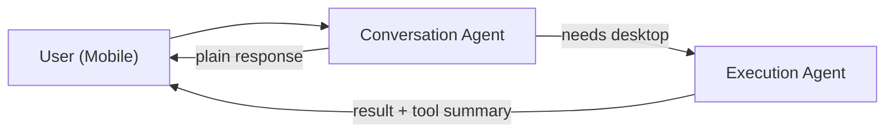
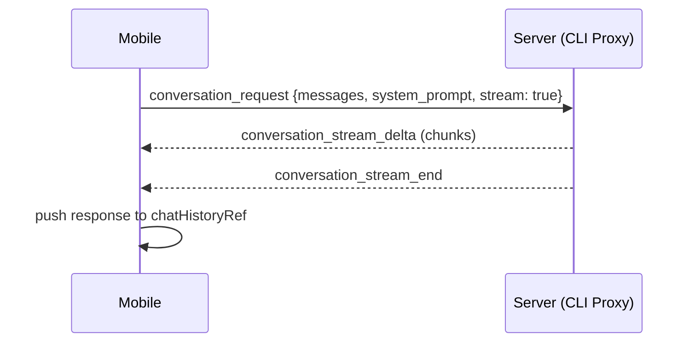
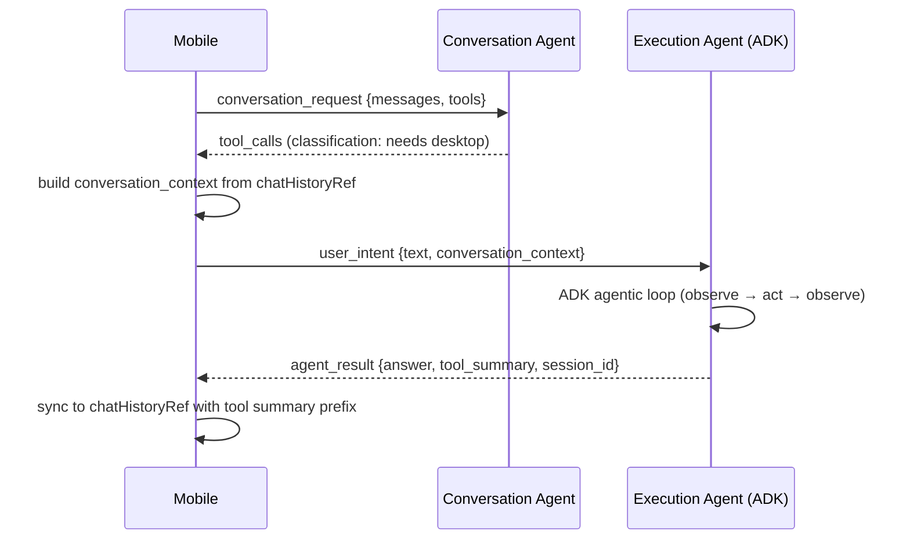
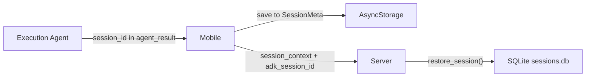

# Context Flow

How conversation context moves through Contop's two-agent architecture — from the moment a user types a message on their phone to the final response, and how that context is maintained across turns, disconnections, and server restarts.

For the agent architecture itself, see [ADK Agent](./adk-agent.md). For the transport layer, see [WebRTC Transport](./webrtc-transport.md).

## The Two-Agent Split

Contop splits AI processing between two agents that see fundamentally different things:



The **conversation agent** handles routing and chat. It sees the full conversation history as text but never touches the desktop. The **execution agent** runs autonomously on the host machine with 40+ tools — it sees its own tool calls and results in detail but only gets a text summary of the broader conversation.

The challenge is keeping both agents contextually aware without duplicating information or wasting tokens. This document explains how that works.

## Lifecycle of a Message

### Plain Chat (No Desktop Action)

When the user sends a message that doesn't require desktop interaction (e.g., "what is 2+2"):



1. Mobile's `sendTextMessage()` pushes the user message to `chatHistoryRef` and sends a `conversation_request` to the server
2. Server forwards to the CLI proxy (Gemini CLI or Claude CLI), which streams back the response
3. Mobile accumulates the streamed text and appends the assistant response to `chatHistoryRef`

The conversation agent receives `chatHistoryRef` as its message history — every prior user and assistant turn.

### Classified Intent (Desktop Execution)

When the user sends something that requires the desktop (e.g., "list files on my desktop"):



1. Mobile's `sendUserIntent()` sends a `conversation_request` with tool declarations for classification
2. The conversation agent decides the request needs desktop execution and returns `tool_calls`
3. Mobile builds a `conversation_context` string from recent `chatHistoryRef` turns and sends a `user_intent` message to the server
4. The execution agent enters its autonomous loop — calling tools, observing results, reasoning about next steps
5. When done, it sends back an `agent_result` containing the answer, a `tool_summary` of what tools it used, and its `session_id`
6. Mobile syncs both the user message and the agent's response (prefixed with tool details) into `chatHistoryRef`

## What Each Agent Sees

### Conversation Agent

The conversation agent receives the full `chatHistoryRef` array as its message history. This includes:

- Every user message
- Every assistant response (both direct chat and execution results)
- A `[Desktop agent used: ...]` prefix on assistant entries that came from execution, listing the tools called and their truncated results

This prefix is how the conversation agent knows what happened during execution. When a user asks "what command did you run to find those files?", the conversation agent can answer directly from this context without routing back to the execution agent.

```
chatHistoryRef = [
  { role: 'user',      content: 'List files on my desktop' },
  { role: 'assistant', content: '[Desktop agent used: Called: execute_cli({"command":"ls ~/Desktop"})\nResult: file1.txt file2.txt]\n\nI found 2 files on your desktop: file1.txt and file2.txt' },
  { role: 'user',      content: 'What command did you use?' },
  { role: 'assistant', content: 'I used the execute_cli tool with the command ls ~/Desktop.' }
]
```

The last turn was answered directly by the conversation agent — no execution needed — because the tool details were visible in the prior assistant entry.

### Execution Agent

The execution agent maintains its own session via Google ADK's `DatabaseSessionService`. This session contains full-fidelity records of every tool call, every tool result, and every intermediate reasoning step — far more detail than the text summaries in `chatHistoryRef`.

On each intent, the execution agent also receives a `conversation_context` string — a text summary of recent mobile-side conversation turns that happened since its last execution. This is how it learns about chat that occurred between execution runs.

The user's current request and the conversation context are combined into a single message:

```
[Prior conversation for context]
User: What's the weather like?
Contop: It's sunny and 72°F.

[Current request]
Open the weather app and check tomorrow's forecast
```

## Conversation Context and Offset Tracking

A naive approach would send the entire `chatHistoryRef` as conversation context on every execution. But the ADK session already contains the history from prior executions — sending it again wastes tokens and grows linearly with conversation length.

Instead, mobile tracks a sync offset (`lastExecutionSyncIndexRef`) — an index into `chatHistoryRef` marking how far the ADK session's knowledge extends. When building `conversation_context`, only turns *after* this offset are included:

```
chatHistoryRef.slice(lastExecutionSyncIndexRef.current)
```

After each execution completes, the offset advances to the end of `chatHistoryRef`. The next execution will only receive turns that are genuinely new.

**Example:**

| Turn | Message | Handled By | Offset After |
|------|---------|-----------|-------------|
| 1 | "What's the weather?" | Conversation agent | 0 |
| 2 | "Check desktop for security risks" | Execution agent | 4 (2 entries x 2 roles) |
| 3 | "How are you?" | Conversation agent | 4 (unchanged) |
| 4 | "Delete that passwords file" | Execution agent | 8 |

On Turn 4, `conversation_context` contains only Turn 3 ("How are you?" and the response). Turns 1-2 are already in the ADK session from Turn 2's execution. Zero duplication.

The offset adjusts automatically when the sliding window (`trimHistory()`) drops old entries from the front of `chatHistoryRef`. On server restart, the offset resets to 0 and the full history is re-sent as conversation context — but the ADK session is also restored from SQLite (see below), so the execution agent still has its detailed tool history.

## Session Persistence

The execution agent's ADK sessions are stored in SQLite at `~/.contop/data/sessions.db`. Every tool call, tool result, and model response is persisted — the full execution history survives server restarts.

### How Session IDs Flow



1. Every `agent_result` includes the ADK `session_id`
2. Mobile stores it in `adkSessionIdRef` (runtime) and `SessionMeta.adkSessionId` (persisted in AsyncStorage)
3. On reconnect, mobile sends `session_context` with the stored `adk_session_id`
4. Server calls `restore_session()` to reload the ADK session from SQLite before processing the next intent

### What Survives a Restart

| Data | Stored In | Survives Server Restart | Survives App Restart |
|------|-----------|------------------------|---------------------|
| ADK tool call history | SQLite `sessions.db` | Yes | N/A (server-side) |
| ADK session ID | `SessionMeta` in AsyncStorage | N/A (mobile-side) | Yes |
| Conversation history | Execution entries in AsyncStorage | N/A (mobile-side) | Yes |
| Tool summary metadata | Execution entry metadata | N/A (mobile-side) | Yes |

### Session Cleanup

Sessions older than 7 days are automatically cleaned up on server startup via `cleanup_old_sessions()`. Screenshot data (`image_b64`) is stripped from tool results before ADK persists them, keeping the database compact.

## Reconnection and Session Continuation

### WebRTC Reconnect (Same Session)

When the WebRTC connection drops and re-establishes (e.g., network blip or server restart):

1. Mobile detects `connectionStatus` change to `connected`
2. If an active session with entries exists:
   - Restores `adkSessionIdRef` from `SessionMeta.adkSessionId` (in case the screen remounted)
   - Rebuilds `chatHistoryRef` from persisted execution entries (including tool summary prefixes)
   - Sends `session_context` with the `adk_session_id` and conversation backstory
3. Server stores the ADK session ID as pending
4. On the next `user_intent`, server restores the ADK session from SQLite before running the intent

### Continue from Session History

When a user opens a previous session from the history screen and taps "Continue":

1. `restoreSession()` loads the session metadata and execution entries into the Zustand store
2. The session change subscription in `index.tsx` detects the new session:
   - Rebuilds `chatHistoryRef` via `restoreHistory()` (including tool summary prefixes from entry metadata)
   - Sends `session_context` (not `new_session`) to the server with the stored `adk_session_id`
3. Server receives the session context and prepares to restore the ADK session on the next intent
4. The conversation can resume where it left off — the execution agent recovers its full tool history from SQLite

### New Session

When the user taps "New Session" from the menu:

1. Current session is finalized and persisted
2. Execution entries are cleared, `chatHistoryRef` is reset, offset returns to 0
3. A `new_session` message is sent to the server, which resets the execution agent's ADK session
4. The next intent creates a fresh ADK session with no prior history

## Subscription Mode (CLI Proxy)

In subscription mode, both agents route through CLI proxy processes rather than calling APIs directly. The proxy converts OpenAI-format messages to XML prompts via `toCliMessage()`:

```xml
<instructions>
  <json_format>...</json_format>
  <rules>...</rules>
</instructions>

<system_context>
  (system prompt, sanitized for CLI safety)
</system_context>

<conversation_history>
  <turn n="1" role="user">Check my desktop for security risks</turn>
  <turn n="2" role="assistant">I found several security risks...</turn>
</conversation_history>
```

Key behaviors:

- **All providers use `useResume: false`** — every LLM call spawns a fresh CLI process with the full history in the prompt. No session chaining between calls.
- **Tool listing is context-aware** — the `<available_functions>` block (listing tool names and descriptions) is included for the conversation agent's 4 classification tools but skipped for the execution agent's 40+ tools, since its system prompt already describes each tool in detail.
- **System prompts are sanitized** — agent identity language and instruction-parsing patterns are rewritten to neutral third-person to avoid triggering CLI guardrails.

For detailed prompt examples showing exactly what each LLM call receives, see `docs/cli-proxy-examples.md` and `docs/cli-proxy-sessions.md` in the project root.

## Key Files

| File | Responsibility |
|------|---------------|
| `contop-mobile/hooks/useConversation.ts` | `chatHistoryRef`, offset tracking, `buildConversationContext()`, `processAgentResult()`, `restoreHistory()` |
| `contop-mobile/app/(session)/index.tsx` | Data channel message handling, `adkSessionIdRef` lifecycle, `session_context` on reconnect |
| `contop-server/core/execution_agent.py` | ADK runner, `DatabaseSessionService`, `tool_summary` building, `restore_session()` |
| `contop-server/core/webrtc_peer.py` | `user_intent` / `session_context` / `new_session` handlers, pending ADK restore |
| `contop-cli-proxy/src/openai-adapter.ts` | `toCliMessage()` XML prompt building, response parsing |
