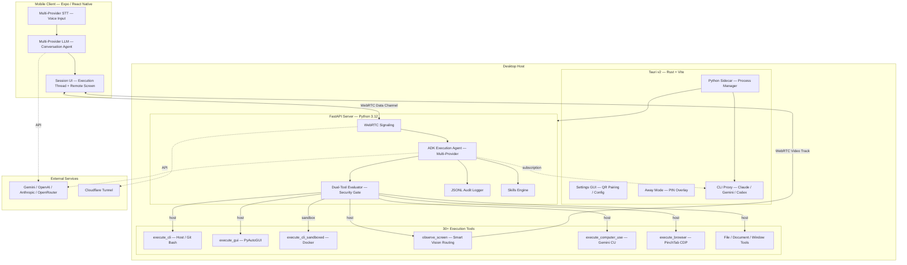

# Architecture Overview

Contop uses a **tri-node architecture** where three components collaborate to deliver AI-powered remote desktop control.

## System Topology

## Node Responsibilities

### Node 1: Mobile Client

- Voice input via configurable STT (Google STT default, also supports OpenAI Whisper and OpenRouter)
- Configurable conversation model (Gemini default, also supports OpenAI, Anthropic, OpenRouter) for intent classification
- Execution thread UI rendering
- Remote screen display via WebRTC video track
- Manual control input (joystick, clicks, keyboard)
- Session persistence and history

### Node 2: Contop Server (Python / FastAPI)

- WebRTC signaling (SDP/ICE exchange)
- [ADK](/architecture/adk-agent) execution agent with 30+ tools (40+ with optional skills)
- [Dual-Tool Evaluator](/security/dual-tool-evaluator) security classification
- Vision pipeline (9 backends for screen understanding)
- JSONL audit logging
- Skills engine (prompt, workflow, python, mixed)

### Node 3: Desktop Host (Tauri / Rust)

- Server lifecycle management (start/stop/restart sidecar)
- Settings GUI and QR code display
- [Away Mode](/user-guide/away-mode) overlay with keyboard blocking
- API key storage in local `settings.json`
- CLI proxy lifecycle management (start/stop/health monitoring for subscription mode)
- Device monitoring and OS notifications

## Why Three Nodes?

| Concern | Handled By |
|---------|-----------|
| User interface | Mobile Client — always in your pocket |
| AI reasoning + tool execution | Contop Server — needs desktop OS access |
| Native OS integration | Desktop Host — Rust for low-level APIs |
| Security isolation | Split between Server (evaluator) and Host (sandboxing) |

The mobile client handles user interaction; the server handles AI reasoning and tool execution; the desktop host handles native OS integration that Python can't do (overlay windows, keyboard hooks, process tree management).

## Communication Protocols

| Path | Protocol | Purpose |
|------|----------|---------|
| Phone ↔ Server | WebRTC Data Channel (DTLS) | Commands, progress, results |
| Phone ← Server | WebRTC Video Track (SRTP) | Live screen feed |
| Phone → Server | WebSocket (initial only) | SDP/ICE signaling exchange |
| Server ↔ Desktop | HTTP localhost | Settings, health, proxy lifecycle |
| Server → Cloud | HTTPS | LLM API calls, tunnel management |
| Server → CLI Proxy | HTTP localhost | Subscription mode LLM routing |

:::note Subscription Mode Vision Limitation
CLI tools (`claude -p`, `gemini`, `codex`) accept only text — they cannot receive base64 images. In subscription mode, the execution agent's LLM vision fallback (direct screenshot analysis when no local vision backend processes a frame) is unavailable. The agent falls back to text-only tools like `get_ui_context`. The mobile app shows a **NO VISION** badge on the execution model card when subscription mode is active.
:::

---

**Related:** [Contop Server](/architecture/contop-server) · [WebRTC Transport](/architecture/webrtc-transport) · [Tool Layers](/architecture/tool-layers)
