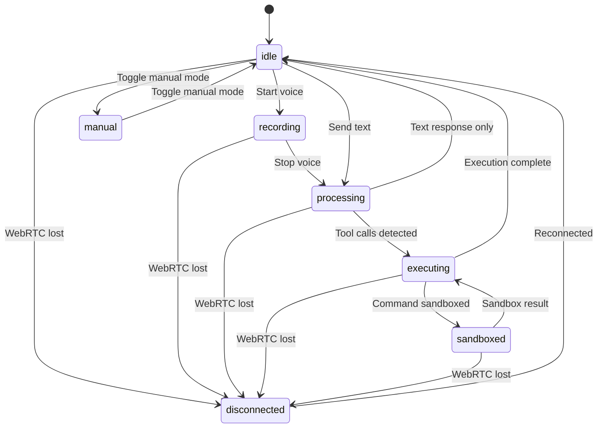

# State Management

Contop's mobile app uses Zustand for centralized state management, with real-time state synchronization via WebRTC data channel messages.

## Mobile Zustand Store (`useAIStore`)

The `useAIStore` is the single source of truth for all application state:

```typescript
type AIStore = {
  // Connection
  connectionStatus: ConnectionStatus;
  connectionPath: string | null;
  connectionType: 'permanent' | 'temp' | null;
  connectionFlow: ConnectionFlowState;

  // AI State
  aiState: AIState;
  executionEntries: ExecutionEntry[];
  isManualMode: boolean;
  manualModeActive: boolean;
  suggestedActions: SuggestedAction[];

  // Layout
  layoutMode: LayoutMode;
  preferredPortraitLayout: LayoutMode;
  preferredLandscapeLayout: LayoutMode;
  orientation: Orientation;

  // Session
  activeSession: Session | null;

  // Device & Security
  isHostKeepAwake: boolean;
  isAwayMode: boolean;
  sendConfirmationResponse: ConfirmationResponseFn | null;
};
```

## AI State Machine



### State Types

| State | Description |
|-------|-------------|
| `idle` | Ready for input |
| `listening` | Legacy state for VoiceVisualizer backward compatibility |
| `recording` | Voice recording active (Zustand state when mic is recording) |
| `processing` | Waiting for conversation model response |
| `executing` | Server agent running tools |
| `sandboxed` | Command executing in Docker sandbox |
| `manual` | Manual control overlay active |
| `disconnected` | WebRTC connection lost |

## Real-Time State Sync

The server sends `state_update` messages via the data channel to synchronize state:

```json
{
  "type": "state_update",
  "id": "uuid",
  "payload": {
    "ai_state": "idle",
    "connection_type": "permanent",
    "keep_host_awake": false
  }
}
```

:::warning
The mobile UI must **never** infer state from timing. All state transitions come from explicit `state_update` messages from the data channel. The 30-second processing timeout is a safety fallback only, not a state inference mechanism.
:::

## Data Channel Message Envelope

All WebRTC data channel messages use a canonical envelope format:

```json
{
  "type": "snake_case_type",
  "id": "uuid-v4",
  "payload": { ... }
}
```

Never mix payloads outside this envelope structure.

## Reset Levels

The Zustand store supports three reset levels:

| Level | Method | Purpose |
|-------|--------|---------|
| **Soft** | `softReset()` | Disconnection recovery — clears transient state |
| **Hard** | `hardReset()` | New server connection — clears execution state |
| **Full** | `resetStore()` | Complete reset, idempotent |

## Execution Thread Data Flow

All execution data flows through `useAIStore.executionEntries[]`. No component maintains its own execution history state. The execution thread UI is a pure render of this array, ensuring a single source of truth for what the agent has done.

---

**Related:** [Mobile App](/user-guide/mobile-app) · [Sessions](/user-guide/sessions) · [Data Channel Protocol](/api-reference/data-channel-protocol)
