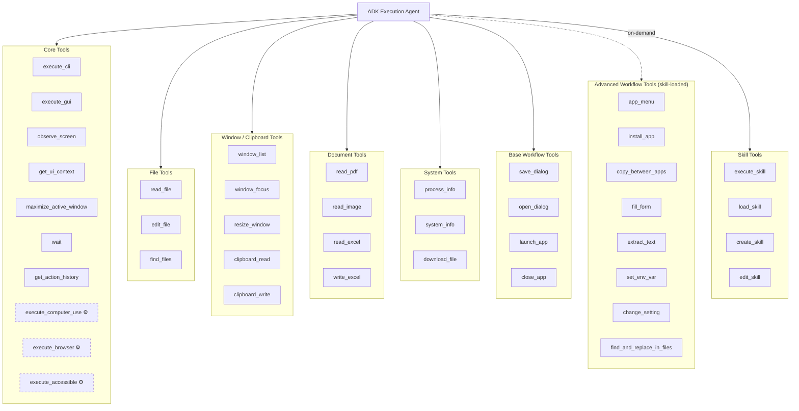

# Tool Layers

The execution agent has access to 30+ base tools organized in 7 functional layers (up to 40+ with optional skills enabled). Tools are registered as plain async callables; only dynamically-loaded skill tools are wrapped as ADK `FunctionTool` instances.

## Tool Organization



> Tools with dashed borders (⚙️) are **conditional** - registered only for specific vision backends. Advanced Workflow Tools are loaded on-demand via the "advanced-workflows" skill. See [Conditional Tools](#conditional-tools) below.

## Tool Return Contract

Every tool returns a dict with `status` as the only universal field. Other keys are tool-specific:

```python
# execute_cli
{"status": "success", "stdout": str, "stderr": str, "exit_code": int, "duration_ms": int}

# observe_screen
{"status": "success", "image_b64": str, "ui_elements": list, "actual_backend": str}

# execute_gui
{"status": "success", "action": str, "target": str, "coordinates": list, "description": str, "duration_ms": int}

# read_pdf
{"status": "success", "content": str, "page_count": int, "pages_read": int, "duration_ms": int}
```

Common optional keys:
- `voice_message` - Optional audio feedback for mobile (present on errors for some tools)
- `image_b64`, `raw_image_b64` - `observe_screen` (annotated + raw screenshots)
- `duration_ms` - Most tools include execution time

## Conditional Tools

Not all tools are registered on every session:

| Tool | Condition |
|------|-----------|
| `execute_computer_use` | Only when `computer_use_backend == "gemini_computer_use"` |
| `execute_accessible` | Only for `"accessibility"` and default (OmniParser/UI-TARS) backends |
| `observe_screen`, `execute_gui`, `get_ui_context`, `maximize_active_window` | Only for `"accessibility"` and default backends (not Gemini CU) |
| `execute_skill`, `load_skill` | Only when at least one skill is enabled |

## Tool Classification

Every tool call passes through the [Dual-Tool Evaluator](/security/dual-tool-evaluator) before execution. Tools have inherent classifications:

| Classification | Tools |
|---------------|-------|
| **Always host** | `execute_gui`, `observe_screen`, `get_ui_context`, `maximize_active_window`, `wait`, `get_action_history`, `execute_computer_use`, `execute_browser`, `execute_accessible` |
| **Evaluator decides** | `execute_cli` (depends on command content) |
| **Always host (file)** | `read_file`, `edit_file`, `find_files` (path-checked) |
| **Always host (window)** | `window_list`, `window_focus`, `resize_window`, `clipboard_read`, `clipboard_write` |
| **Always host (document)** | `read_pdf`, `read_image`, `read_excel`, `write_excel` |
| **Always host (system)** | `process_info`, `system_info`, `download_file` |
| **Always host (workflow)** | `save_dialog`, `open_dialog`, `launch_app`, `close_app`, `fill_form`, `extract_text`, `copy_between_apps`, `app_menu` |
| **Direct bypass** | `device_control`, `manual_control` (not ADK tools - direct handlers) |

---

**Related:** [ADK Agent](/architecture/adk-agent) · [Core Tools](/api-reference/tools/core-tools) · [Security Overview](/security/overview)
