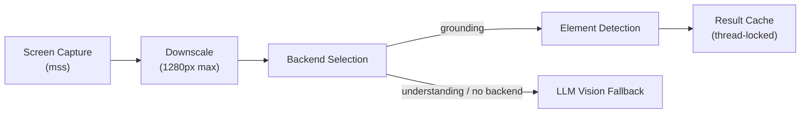

# Vision Routing

Contop's vision system routes screen understanding tasks through 9 different backends, each optimized for different scenarios.

## Pipeline

1. **Capture** - `mss` screen capture (thread-local instances - mss is not thread-safe)
2. **Downscale** - Resize to 1280px max width for consistent coordinate space
3. **Backend selection** - Route to the configured vision backend
4. **Parse** - Detect UI elements, extract coordinates and labels
5. **Cache** - Results cached behind `_parse_lock` (thread-safe) for shared access between `observe_screen` and `execute_gui`

## Nine Vision Backends

| Backend | Source Module | Coordinates | Use Case |
|---------|-------------|-------------|----------|
| **UI-TARS** (default) | `tools/vision_client.py` | Pixel coordinates | Fast single API call via OpenRouter |
| **OmniParser** | `tools/omniparser_local.py` | 0–1 normalized bbox | Local-first, privacy-preserving, GPU/CPU adaptive |
| **Gemini Computer Use** | `tools/gemini_computer_use.py` | 0–999 normalized | Planning-only adapter with stateful history |
| **Accessibility Tree** | `tools/ui_automation.py` | Element-based (no coords) | Deterministic, best for native app UIs |
| **Kimi Vision** | `tools/vision_client.py` | Pixel coordinates | Alternative VLM via OpenRouter |
| **Qwen Vision** | `tools/vision_client.py` | Pixel coordinates | Alternative VLM via OpenRouter |
| **Phi Vision** | `tools/vision_client.py` | Pixel coordinates | Alternative VLM via OpenRouter |
| **Molmo Vision** | `tools/vision_client.py` | Pixel coordinates | Alternative VLM via OpenRouter |
| **Holotron Vision** | `tools/vision_client.py` | Pixel coordinates | Alternative VLM via OpenRouter |

## Dual-Mode Vision

### Grounding Mode (`mode="grounding"`)

Returns element coordinates for GUI automation:
- Bounding boxes around clickable elements
- Text labels from OCR
- Element types (button, text field, checkbox, etc.)

### Understanding Mode (`mode="understanding"`)

Returns a natural language description of the screen:
- What's visible on screen
- Layout and content summary
- Used for context gathering before complex tasks

## Coordinate Systems

Each backend uses a different coordinate system. The GUI automation layer normalizes everything to native screen coordinates:

| Backend | Raw Coordinates | Conversion |
|---------|----------------|------------|
| UI-TARS | Pixel (screenshot-space) | `_scale(x, y, sx, sy)` |
| OmniParser | 0–1 normalized | `x_pixel = bbox[0] * img_width`, then scale |
| Gemini CU | 0–999 normalized | `pixel = (normalized / 1000) * capture_dim` |
| Accessibility | Element references | No coordinate conversion needed |

The `_scale(x, y, sx, sy)` function in `gui_automation.py` converts from screenshot-space (1280px max width) to native screen coordinates using scale factors from the `frame` context payload.

## OmniParser Details

OmniParser runs locally and adapts to available hardware:

| Mode | Features |
|------|----------|
| **GPU** | Florence-2 captioning enabled, YOLO at `imgsz=640` |
| **CPU** | Captioning disabled (~30s too slow), YOLO at `imgsz=416` (2.4x speedup) |

Key thresholds: `BOX_THRESHOLD=0.20`, `IOU_THRESHOLD=0.7`, `OCR_CONFIDENCE=0.8`

Deduplication merges overlapping boxes (IoU > 0.8), preferring icon detections over OCR text.

## Backend Fallback

Vision backends degrade gracefully:
- **UI-TARS** → Returns `None` on failure (rate limit, timeout) → Agent falls back to OmniParser
- **OmniParser understanding mode** → Bypasses to `needs_llm_vision=True` for direct LLM interpretation
- **Accessibility backend** → Falls back to `observe_screen` + `execute_gui` when elements not found

## Hallucination Guardrails

Vision system prompts enforce:
- **No Fabricated Details** - Report only what's visible on screen
- **Verify After execute_gui Type** - Always re-observe screen after typing to confirm text was entered correctly

---

**Related:** [Tool Layers](/architecture/tool-layers) · [ADK Agent](/architecture/adk-agent) · [Agent Execution](/user-guide/agent-execution)
