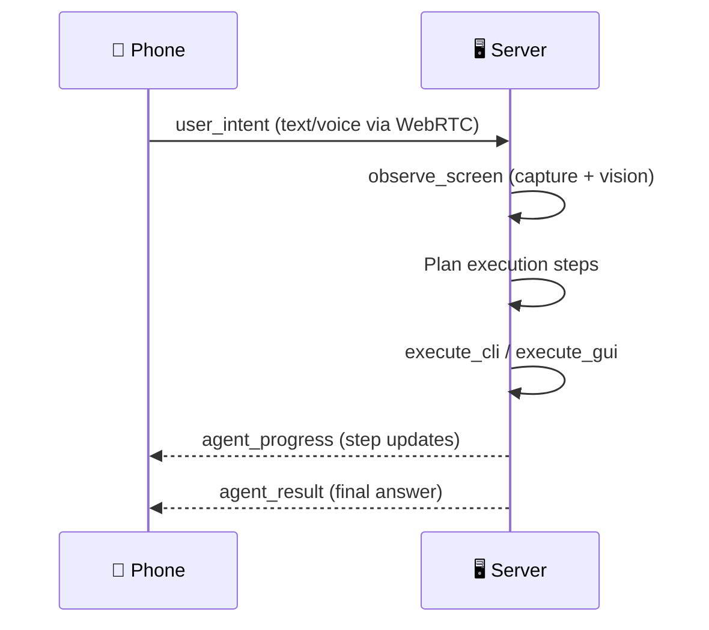

# Quick Start

Get Contop running in under 5 minutes.

## Step 1: Launch the Desktop App

Open Contop from your Start Menu, Applications folder, or run the AppImage.

`[SCREENSHOT: Contop desktop app main window with QR code]`

:::note First launch
If this is your first time opening Contop (after installing via Homebrew, Scoop, or direct download on macOS/Linux), the app will automatically download and install Python dependencies. A progress overlay shows the download status - this takes a few minutes depending on your internet speed. Subsequent launches skip this step.
:::

The app automatically starts the Python server as a sidecar process. You'll see the QR code appear once the server is ready.

## Step 2: Open the Mobile App

Launch Contop on your phone. The app opens to the connection screen.

`[SCREENSHOT: Mobile app connection screen]`

## Step 3: Scan the QR Code

Tap **Scan QR Code** on the mobile app and point your camera at the desktop QR code.

`[SCREENSHOT: QR scanning in progress]`

The QR code contains:
- Server connection details (LAN IP, Tailscale IP, tunnel URL)
- Pairing token for authentication
- DTLS certificate fingerprint for [WebRTC](/architecture/webrtc-transport) encryption verification
- Subscription mode flags (which providers use CLI proxy instead of API keys)

## Step 4: Authenticate

Complete biometric authentication (Face ID, Touch ID, or Android biometric) to confirm the pairing.

`[SCREENSHOT: Biometric authentication prompt]`

## Step 5: Start Commanding

You're connected! Type a message in the execution bar or tap the microphone to use voice input.

`[SCREENSHOT: Connected session with execution thread]`

Try these example commands:

```
"Open Chrome and search for the weather"
"Create a new folder on my desktop called Projects"
"What's currently on my screen?"
"Open the terminal and run git status"
```

The [execution agent](/architecture/adk-agent) will:
1. Observe your screen via screenshot + element detection
2. Plan the necessary steps
3. Execute CLI commands and GUI actions
4. Report results back to your phone in real time

## What Happens Behind the Scenes



## Next Steps

- [Configure API keys and security settings](/getting-started/configuration)
- [Learn about the mobile app interface](/user-guide/mobile-app)
- [Set up remote access via Tailscale or Cloudflare](/user-guide/connection-methods)

---

**Related:** [Installation](/getting-started/installation) · [Configuration](/getting-started/configuration) · [Mobile App](/user-guide/mobile-app) · [Agent Execution](/user-guide/agent-execution)
