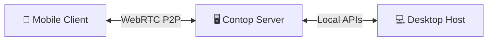

import { Card, CardGrid } from '@site/src/components/Card';

# Contop

Remote AI agent that sees your screen and operates your computer. Speak a command or type a message - an autonomous agent observes your screen, runs commands, clicks buttons, fills forms, and reports back in real time.

## How It Works

Contop uses a **three-node architecture** connected over encrypted WebRTC:

1. **Mobile Client** (React Native / Expo) - Voice and text input, execution thread UI, live remote screen feed
2. **Contop Server** (Python / FastAPI) - ADK execution agent, 30+ tools, security evaluation, WebRTC signaling
3. **Desktop Host** (Tauri v2 / Rust) - Native app shell, server lifecycle management, Away Mode protection

Explore the Docs

<CardGrid>
  <Card title="Getting Started" description="System requirements, installation guide, quick start tutorial, and initial configuration." href="/getting-started/system-requirements" />
  <Card title="User Guide" description="Mobile app, desktop app, voice and text input, manual control, device management, and Away Mode." href="/user-guide/mobile-app" />
  <Card title="Architecture" description="Tri-node topology, WebRTC transport, ADK execution agent, tool layers, and vision routing." href="/architecture/overview" />
  <Card title="Developer Guide" description="Contributing guidelines, project structure, platform adapters, testing, and build processes." href="/developer-guide/contributing" />
  <Card title="API Reference" description="REST endpoints, data channel protocol, 30+ tool definitions, configuration, and skills engine." href="/api-reference/rest-api" />
  <Card title="Security" description="QR pairing, end-to-end encryption, Dual-Tool Evaluator, Docker sandbox, and JSONL audit logging." href="/security/overview" />
</CardGrid>

Key Features

<CardGrid>
  <Card title="Multimodal AI Agent" description="Voice commands via configurable STT (Google STT default), screen understanding via 9 vision backends, autonomous multi-step execution with the Google ADK." />
  <Card title="Security-First Design" description="Every command classified by the Dual-Tool Evaluator. Dangerous commands sandboxed in Docker. Destructive actions require explicit approval." />
  <Card title="Zero-Config Networking" description="QR code pairing, automatic Cloudflare Tunnel fallback, WebRTC peer-to-peer with DTLS encryption. No port forwarding or VPN required." />
  <Card title="Multi-Provider LLM" description="Gemini, OpenAI, Anthropic, Groq, Mistral, Together AI, DeepSeek, and more - switch models without code changes." />
  <Card title="Hybrid Control" description="Seamlessly switch between AI execution and manual remote control with virtual joystick, tap-to-click, and keyboard grid overlay." />
  <Card title="Away Mode" description="Lock your desktop when unattended with PIN protection, keyboard blocking, and a secure overlay window (Windows)." />
</CardGrid>
