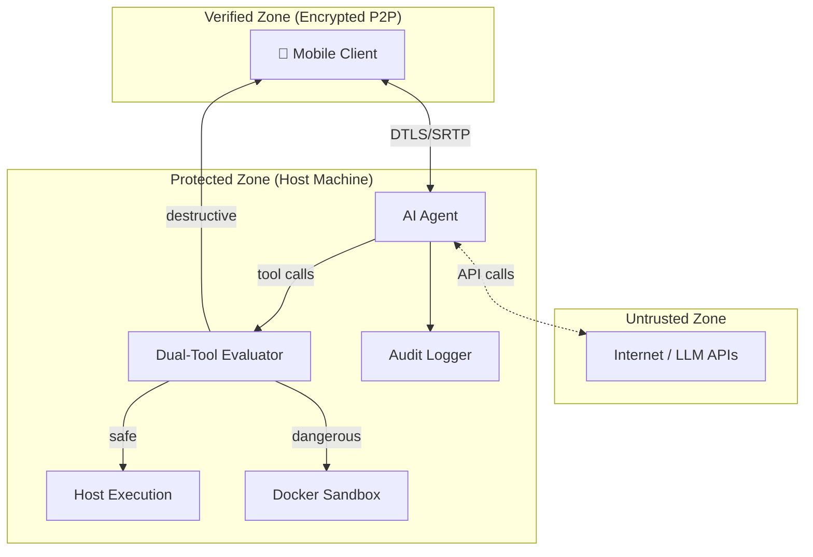

# Security Overview

Contop follows a **defense-in-depth** approach with multiple security layers. The system assumes zero trust between components and implements security at every boundary.

## Security Philosophy

- **Defense-in-depth** - Multiple independent security layers, so a failure in one doesn't compromise the system
- **Zero trust** - Every command is classified before execution, regardless of source
- **Local-first** - Data stays on your devices; no cloud intermediary for execution
- **Transparent** - Every action is logged and visible to the user in real time

## Trust Boundaries

## Security Layers

| Layer | Purpose | Documentation |
|-------|---------|--------------|
| **Transport Encryption** | DTLS data channels + SRTP video | [Pairing & Encryption](/security/pairing-and-encryption) |
| **Command Classification** | Every command evaluated before execution | [Dual-Tool Evaluator](/security/dual-tool-evaluator) |
| **Sandbox Isolation** | Dangerous commands run in hardened Docker containers | [Docker Sandbox](/security/docker-sandbox) |
| **Audit Trail** | Every tool call logged with timestamps and outcomes | [Audit Logging](/security/audit-logging) |
| **Physical Access Protection** | Away Mode locks the desktop when unattended | [Away Mode Security](/security/away-mode-security) |

## Threat Model Summary

| Threat | Mitigation |
|--------|-----------|
| Unauthorized device access | QR code pairing + biometric auth + token expiration |
| Man-in-the-middle | DTLS/SRTP encryption + certificate fingerprint in QR |
| Malicious AI commands | Dual-Tool Evaluator classifies every command |
| Destructive actions | User confirmation required + Docker sandboxing |
| Credential exposure | Environment isolation in sandbox |
| Physical access when away | Away Mode overlay + keyboard hook + PIN protection |
| LLM prompt injection | Security-focused system prompt, tool classification independent of LLM output |

---

**Related:** [Dual-Tool Evaluator](/security/dual-tool-evaluator) · [Docker Sandbox](/security/docker-sandbox) · [Pairing & Encryption](/security/pairing-and-encryption) · [Audit Logging](/security/audit-logging)
